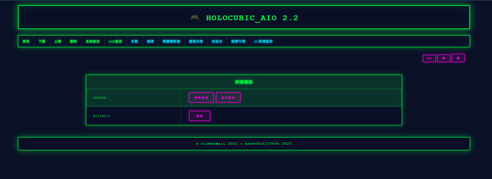

# HoloCubic_AIO（HoloCubic一体化固件）

> 🌍 _您也可以阅读本文件的其他语言版本 [English 英文版](./README.md)_


## 📖 项目介绍

`Holocubic`最初是[稚晖君](https://github.com/peng-zhihui)的开源项目，本项目是运行在HoloCubic硬件上的第三方独立固件。

**AIO**代表**一体化（All in One）**，目标是将尽可能多的功能集成到Holocubic固件中，并坚持开源。固件目前包含`20,000+`行代码，上位机软件`4,000`行代码（不包括字库和图片）。我们诚邀大家共同开发AIO固件、上位机及周边功能，让固件满足更多用户的需求。

本固件完全开源，供学习和实验使用。如果您使用本项目进行二次开发或部分参考，请适当注明来源。

### 🔗 项目链接

* **原作者项目**: https://github.com/peng-zhihui/HoloCubic
* **原AIO项目**: https://github.com/ClimbSnail/HoloCubic_AIO
* **本项目（最新版）**: https://github.com/asdfghj1237890/HoloCubic_AIO

---

## 👥 开发团队

* **AIO框架与核心应用**: [ClimbSnail](https://github.com/ClimbSnail)
* **2048游戏**: [AndyXFuture](https://github.com/AndyXFuture)
* **新版天气时钟**: [PuYuuu](https://github.com/PuYuuu)
* **BiliBili粉丝应用**: [cnzxo](https://github.com/cnzxo/)
* **纪念日与心跳应用**: [WoodwindHu](https://github.com/WoodwindHu)
* **PC资源监控**: [Jumping99](https://github.com/Jumping99)
* **多功能动画**: [LHYHHD](https://github.com/LHYHHD)
* **股票应用**: redwolf
* 更多开发者持续加入中...

---

## 💬 社区交流

**欢迎加入AIO内测QQ讨论群：**

| 群组 | QQ群号 |
|------|--------|
| 一群 | `755143193` |
| 二群 | `860112883` |
| 三群 | `676732387` |
| 四群 | `749207817` |
| 五群 | `866784418` |


---

## ✨ 主要特性

1. **丰富的应用生态**：内置天气、时钟、相册、特效动画、视频播放、电脑投屏、网页设置等多种应用
2. **灵活的硬件支持**：无论是否插入TF卡、MPU6050焊接状态、WiFi连接状态（需要2.4G WiFi），都不影响系统正常启动
3. **模块化设计**：低耦合架构，易于扩展
4. **网页配置**：通过网页界面进行配网及各项设置（详见应用介绍）
5. **多种访问方式**：支持IP地址访问或域名直接访问 http://holocubic（部分浏览器可能支持不佳）
6. **远程文件管理**：通过网页界面上传/删除SD卡文件，无需物理拔插
7. **完整的PC工具**：提供全套上位机软件及开源代码：https://github.com/ClimbSnail/HoloCubic_AIO_Tool

### 📺 演示视频

**功能操作演示**: https://www.bilibili.com/video/BV1wS4y1R7YF/

<details>
<summary>📸 界面截图</summary>


</details>

---

## 🔧 固件刷写（无需IDE环境）

从QQ群下载上位机工具进行固件刷写。

### 所需文件

1. `bootloader_dio_40m.bin` - 引导加载程序
2. `partitions.bin` - 分区文件
3. `boot_app0.bin` - 启动应用
4. `HoloCubic_AIO_XXX.bin` - 最新固件（随版本更新）

> **注意**：文件1-3在各版本间保持稳定，只有固件文件（`HoloCubic_AIO_XXX.bin`）会随版本更新。

### 刷写步骤

1. 将文件1-3与`CubicAIO_Tool.exe`放在同一目录
2. 运行`CubicAIO_Tool.exe`
3. 在软件中选择最新固件`HoloCubic_AIO_XXX.bin`
4. 刷写固件

**视频教程**: https://b23.tv/5e6uDh

**开源上位机工具**: https://github.com/ClimbSnail/HoloCubic_AIO_Tool

<details>
<summary>🖼️ 工具截图</summary>


</details>

---

## 📚 避坑指南

硬件组装或焊接遇到问题？请查看我们的详细避坑指南：

**[🔧 HoloCubic小电视──小白避坑指南v2.4](./HoloCubic小电视──小白避坑指南v2.4.md)**

本指南涵盖：
- 硬件版本说明与兼容性
- PCB打样与焊接教程
- 常见问题及解决方案
- 元器件选购与推荐商家
- 万用表使用与测试步骤
- 详细的电路连线图与参考电压

---

## 🚀 快速开始

### ⚠️ 开机注意事项

设备使用MPU6050陀螺仪加速度计，为确保正确初始化：

1. **开机前3秒保持设备静止**（不要手持）
2. 等待传感器初始化完成 - RGB灯会完全亮起
3. 初始化完成后即可正常操作

> **故障排查**：如果MPU6050焊接有问题，方向读取会错乱（表现为应用不断切换）。TF卡插入与否不影响开机。

### 🎮 操作指南

#### TF卡设置
- **文件系统**：FAT32
- **必需用于**：相册、视频播放
- **设置**：首次使用前，将`放置到内存卡`目录中的所有文件和文件夹复制到TF卡根目录
- **注意**：设备可以在没有TF卡的情况下正常启动，但某些应用功能需要TF卡

#### 手势控制
| 手势 | 持续时间 | 动作 |
|------|----------|------|
| 左右摇晃 | 0.5秒 | 切换应用 |
| 向前倾斜 | 1秒 | 进入当前应用 |
| 向后倾斜 | 1秒 | 退出当前应用 |

---

## 📱 应用介绍

<details>
<summary><b>🌐 网页配置服务（Web Server）</b></summary>



- **运行条件**：无（WiFi信息保存在flash中，独立于TF卡）
- **访问方式**：
  - 设备创建AP热点`HoloCubic_AIO`（无密码），地址为`192.168.4.2`
  - 或使用域名：http://holocubic
  - 推荐：使用IP地址访问以获得更好兼容性
- **功能特性**：
  - 系统参数配置
  - 天气应用设置
  - 相册参数
  - 播放器设置
  - 自启动应用配置

**首次设置**：连接电脑到HoloCubic的WiFi热点，然后通过网页界面进行配置。

</details>

<details>
<summary><b>📁 文件管理器（File Manager）</b></summary>

**用途**：通过无线网络管理TF卡文件

- **运行条件**：
  - WiFi已配置
  - TF卡已插入
  - USB供电充足
- **使用方法**：通过Windows文件资源管理器输入：`ftp://holocubic:aio@[您的IP]`
  - 将`[您的IP]`替换为设备屏幕显示的IP地址

> ⚠️ **注意**：部分功能仍在开发中

</details>

<details>
<summary><b>🖼️ 相册（Picture）</b></summary>

- **运行条件**：
  - TF卡包含`image/`目录
  - 图片文件格式为`.jpg`或`.bin`
- **设置步骤**：
  1. 使用PC工具转换图片（任意分辨率，自动压缩）
  2. 保存到`image/`目录
  3. 文件名必须为字母数字（不能以数字开头）
- **图片格式**：
  - 天气图标：C数组（索引16色）
  - 其他图片：二进制RGB565 `.bin`或`.jpg`
- **设置**：可通过WebServer配置附加功能

</details>

<details>
<summary><b>🎬 视频播放器（Media）</b></summary>

- **运行条件**：TF卡包含`movie/`目录
- **设置步骤**：
  1. 使用转换工具转换视频（推荐1:1宽高比）
  2. 保存为`.mjpeg`或`.rgb`格式到`movie/`目录
  3. 文件名必须为字母数字（不能以数字开头）
- **省电模式**：
  - 闲置90秒后进入低功耗模式
  - 闲置120秒后进入二级低功耗模式（帧率降低）
- **设置**：可通过WebServer配置附加功能

</details>

<details>
<summary><b>🖥️ 屏幕分享（Screen Share）</b></summary>

- **运行条件**：
  - 通过Web Server配置WiFi
  - USB供电充足
- **PC工具**：使用[大大怪的工具](https://gitee.com/superddg123/esp32-TFT/tree/master)
- **提示**：如果画面卡顿可降低画质以提升帧率

</details>

<details>
<summary><b>🌤️ 天气与时钟（Weather）</b></summary>

#### 新版天气（weather）
- **API**：高德天气API
- **运行条件**：联网状态
- **设置**：
  - 配置城市代码：[高德城市代码](https://lbs.amap.com/api/webservice/download)
  - 获取API密钥：[高德密钥申请](https://lbs.amap.com/api/webservice/create-project-and-key)
- **界面**：模仿`misaka`时钟界面

#### 旧版天气（weather old）
- **API**：心知天气API（v3版本）
- **运行条件**：联网状态，TF卡可选
- **设置**：
  - 将`weather/`文件夹复制到TF卡根目录（部分图标存储在卡中）
  - 在 https://seniverse.com 配置城市名和API密钥
- **界面**：模仿[CWEIB](https://github.com/CWEIB)

> **注意**：即使断网后，时钟依然运行。建议开机时连接WiFi以自动同步时间。

</details>

<details>
<summary><b>✨ 特效动画（Idea）</b></summary>

- **运行条件**：无
- **功能**：内置多种特效动画
- **致谢**：移植自社区成员"小飞侠"

</details>

<details>
<summary><b>🎮 2048游戏</b></summary>

- **运行条件**：无（仅需屏幕正常显示）
- **操作说明**：
  - 上/下：快速倾斜
  - 进入/退出：保持倾斜1秒
- **开发者**：[AndyXFuture](https://github.com/AndyXFuture/HoloCubic-2048-anim)

</details>

<details>
<summary><b>📺 BiliBili粉丝应用</b></summary>

- **运行条件**：
  - TF卡包含`bilibili/`文件夹
  - WiFi已配置
  - 头像图片：`bilibili/avatar.bin`（100×100像素）
- **设置步骤**：
  1. 获取UID：访问 https://space.bilibili.com/（URL中的数字）
  2. 在WebServer中配置UID
  3. 添加头像图片（使用AIO工具转换）
- **开发者**：cnzxo

</details>

<details>
<summary><b>🎂 纪念日（Anniversary）</b></summary>

- **运行条件**：联网状态
- **设置**：通过WebServer配置
  - 名称和日期（格式：`2022.5.8`）
  - 年份=0表示每年重复的纪念日（如生日）
  - 支持最多2个纪念日
- **支持的字符**：`生日还有毕业养小恐龙种土豆老婆女朋友爸妈爷奶弟妹兄姐结婚纪念`
- **致谢**：基于[LizCubic](https://github.com/qingehao/LizCubic)，由WoodwindHu开发

</details>

<details>
<summary><b>💓 心跳（Heartbeat）</b></summary>

- **运行条件**：
  - 联网状态（性能模式）
  - MQTT服务器（端口1883）
  - 两台HoloCubic设备
- **设置**：通过WebServer配置
  - Role：0或1（代表两台设备）
  - Client ID：两台设备使用相同的QQ号
  - MQTT服务器、端口、凭证
- **使用方法**：收到配对设备消息后自动进入应用
- **致谢**：基于[LizCubic](https://github.com/qingehao/LizCubic)，由WoodwindHu开发

> 群内不定期更新免费MQTT服务信息

</details>

<details>
<summary><b>📈 股票行情（Stock）</b></summary>

- **运行条件**：WiFi已配置，USB供电充足
- **设置**：通过WebServer配置股票代码
- **开发者**：redwolf

</details>

<details>
<summary><b>💻 PC资源监控（PC Resource）</b></summary>

- **运行条件**：
  - WiFi已配置
  - PC与HoloCubic在同一网段
  - PC安装[AIDA64](https://www.aida64.com/downloads)
- **设置步骤**：
  1. 导入配置文件`aida64_setting.rslcd`（位于`AIO_Firmware_PIO\src\app\pc_resource\`）
  2. 在WebServer中设置PC服务IP地址
- **开发者**：Jumping99

> 详细操作步骤请参见群文档

</details>

<details>
<summary><b>🎨 多功能动画（LH&LXW）</b></summary>

**操作方式**：
- 向后倾斜：进入应用/进入选中功能
- 向前倾斜：退出
- 左右倾斜：切换功能

### 功能列表

**1. 代码雨（Matrix Rain）**
- 左/右：切换大小
- 前倾：退出

**2. 赛博相册（Cyber Album）**
- **TF卡设置**：
  ```
  ./LH&LXW/cyber/imgx.cyber (x=0~99)
  ./LH&LXW/cyber/cyber_num.txt (图片数量，如"07")
  ```
- **图片转换**（48×40像素）：

```python
import cv2
img_path = './123.jpg'
out_path = './123.cyber'
img = cv2.imread(img_path)
img = cv2.cvtColor(img, cv2.COLOR_BGR2GRAY)
with open(out_path, 'wb') as f:
    for a in img:
        for b in a:
            f.write(b)
```

- **操作**：
  - 左倾：停止自动切换
  - 右倾：恢复自动切换
  - 后倾：切换静态/动态
  - 前倾：退出

**3. QQ超级表情（QQ Emoji）**
- **TF卡设置**：
  ```
  ./LH&LXW/emoji/videos/videox.mjpeg (240×240, x=0~99)
  ./LH&LXW/emoji/images/imagex.bin (60×60, x=0~99)
  ./LH&LXW/emoji/emoji_num.txt (视频数量)
  ```
- **操作**：
  - 左/右：选择表情
  - 后倾：播放当前表情
  - 前倾：退出（选择时）或停止播放
- 每个表情自动循环播放33.3秒

**4. 眼珠子动画（Eye Animation）**
- 左/右：切换眼睛样式
- 前倾：退出

**5. 动态心（Dynamic Heart）**
- 摇晃设备：粒子散开
- 保持静止：粒子聚合成心形
- 前倾：退出

**演示视频**：https://www.bilibili.com/video/BV1wK421173C

</details>

---

## 🛠️ 开发与编译

### 构建环境

本项目基于**VSCode**的**PlatformIO**插件，使用**ESP32-Pico Arduino**平台开发。

**教程**：https://b23.tv/kibhGD

### 设置步骤

1. **配置上传端口**：修改`platformio.ini`中的`upload_port`为您的COM口

2. **禁用应用（可选）**：要排除内置应用，在`AIO_Firmware_PIO\src\app\app_conf.h`中将对应的`APP宏`设为`0`

3. **SPI库**：✅ 无需修改！项目在`lib/`目录中包含了预配置的SPI库，引脚设置正确

<details>
<summary>📜 旧版SPI配置说明（仅供参考 - 可忽略）</summary>

~~旧版本需要手动修改SPI库以防止SD卡读取失败：~~

~~PlatformIO和Arduino IDE用户都需要将SPI库中的MISO默认引脚修改为`26`。例如，在Arduino IDE的包路径`esp32\hardware\esp32\1.0.4\libraries\SPI\src\SPI.cpp`中：~~

```cpp
if(sck == -1 && miso == -1 && mosi == -1 && ss == -1) {
    _sck = (_spi_num == VSPI) ? SCK : 14;
    _miso = (_spi_num == VSPI) ? MISO : 12; // 改为26
    _mosi = (_spi_num == VSPI) ? MOSI : 13;
    _ss = (_spi_num == VSPI) ? SS : 15;
```

~~这是必要的，因为硬件使用两个硬件SPI连接屏幕和SD卡。HSPI的默认MISO引脚12在ESP32启动时用于设置flash电压，开机前上拉会导致芯片无法启动。我们将其替换为引脚26。~~

</details>

---

## 📐 架构与框架

### 框架图


**框架讲解视频**：https://www.bilibili.com/video/BV1jh411a7pV?p=4

### 开发资源

#### UI设计工具
- **Edgeline**
- **GUI Guider**

#### LVGL资源
- **学习**：http://lvgl.100ask.org | http://lvgl.100ask.net
- **模拟器**：https://github.com/lvgl/lv_platformio
- **字体工具**：`LvglFontTool V0.4`（位于`Doc/`目录）

#### 素材资源
- **应用图标**（128×128）：从[阿里矢量图标库](https://www.iconfont.cn/)下载

#### 开发工具

**调试错误定位**：
```bash
xtensa-esp32-elf-addr2line -pfiaC -e 固件名.elf [回溯地址]
```

**从C文件提取汉字**：
```bash
python Script/get_font.py 字模文件路径.c
```

---

## 📝 版本历史

**当前版本**：`v2.3.0`

<details>
<summary><b>v2.3.x</b> - 最新版本</summary>

### 固件更新
- **股票**：重构数据处理与UI，新增国际股市支持，修复内存泄漏
- **天气**：集成AccuWeather API，提升稳定性，多语言与繁体中文字体优化
- **Web设置**：增强多语言支持和界面
- **纪念日**：修复时间API
- **其他**：精简不必要功能与资源；修复字体包含问题；优化番茄钟界面

</details>

<details>
<summary><b>v2.2.x</b></summary>

- 将LVGL更新至v8.3.3，修改所有涉及LVGL的应用
- 修复所有有返回值但缺少return语句的函数

</details>

<details>
<summary><b>v2.1.x</b></summary>

- 新增天气字库
- 新增股票应用
- 新增亮度调节阈值以防止死机

</details>

<details>
<summary><b>v2.0.x</b></summary>

- 修复7日天气只读北京问题，修改API，新增湿度
- 支持调整MPU6050操作方向映射
- 支持LittleFS（迁移现有KV存储）
- SD卡支持SPI，SD双模式（待更新）
- 新增参数设置
- 协调调整投屏上位机（待更新）
- 修复2048（待更新）
- 支持隐藏应用（待更新）
- 修复BiliBili API和内存泄漏
- 修复所有应用使用LVGL时缺少`lv_style_reset`导致的内存泄漏
- 新版天气支持三字城市名
- 新增性能模式支持
- 新增心跳和纪念日应用

</details>

<details>
<summary><b>v1.9.x</b></summary>

- 大幅改进屏幕分享应用，修复卡顿问题（防止过热，性能设为中等）
- 新增FTP文件传输支持（上位机未更新）
- 视频播放中加入发热控制，防止ESP32过热损坏

</details>

<details>
<summary><b>v1.8.x</b></summary>

- 新增2048游戏、新版天气时钟、BiliBili粉丝应用
- 修改MPU6050操作，新增两个键值
- 修改图片循环播放，修复时钟界面卡顿
- 新增事件队列

</details>

<details>
<summary><b>v1.7.x</b></summary>

- 新增屏幕分享和设置应用
- 新增应用名称
- WebServer中新增屏幕亮度和方向调节
- 增强视频和相册方向切换支持
- 修复Idea应用中图形未清空导致的重叠
- 修复部分应用内存未释放问题
- 将天气图标更改为和风天气图标

</details>

<details>
<summary><b>v1.6.x</b></summary>

- 调整屏幕亮度和WiFi调度控制，降低功耗
- 修改TFT_eSPI库以消除开机花屏
- 在保持RGB播放功能的同时，新增MJPEG视频播放，帧率提升至20fps

</details>

<details>
<summary><b>v1.5.x</b></summary>

- 新增视频播放（持续改进中）
- 新增MPU6050校准，实现对倾斜底座的兼容
- 相册功能支持JPG和BIN双格式
- 新增Idea动画应用
- 加速开机显示

</details>

<details>
<summary><b>v1.4</b></summary>

- 大量修改程序框架
- 新增屏幕亮度控制
- 修复相册切换时的"白屏"现象

</details>

<details>
<summary><b>v1.3</b></summary>

- 将WiFi配置从SD卡移至flash（非相册应用无需SD卡）
- 调整RGB氛围灯
- 新增`movie/`目录到SD卡结构

</details>

### 上位机工具更新

<details>
<summary><b>HoloCubic_AIO_Tool v1.6.0</b></summary>

- 新增多语言支持（繁体中文、英文等）
- 新增工具设置页面
- 修复MJPEG工具问题，新增视频转换日志和线程支持
- 改进ffmpeg命令实时输出捕获
- 增强输入文件错误处理和验证

</details>

---

## 🙏 致谢

### 技术参考
- **ESP32内存分布**：https://blog.csdn.net/espressif/article/details/112956403
- **视频播放**：https://github.com/moononournation/RGB565_video
- **FTP实现**：https://blog.csdn.net/zhubao124/article/details/81662775
- **ESP32 Arduino双核**：https://www.yiboard.com/thread-1344-1-1.html
- **强制门户认证**：https://blog.csdn.net/xh870189248/article/details/102892766

### 开源库
特别感谢`lib/`目录中使用的所有开源库作者。

---

## 📄 许可证

本项目开源。如果您使用本项目进行二次开发或部分参考，请适当注明来源。

---

**由HoloCubic AIO社区用❤️制作**
